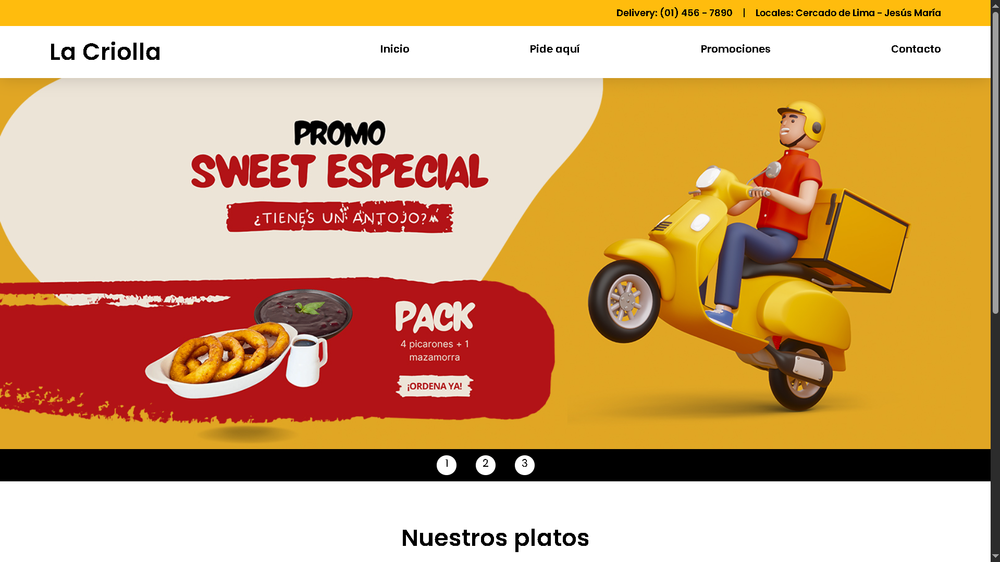

# proyecto-restaurante-web



## 📌 Descripción
Este proyecto consiste en el desarrollo de un sitio web para un restaurante criollo.  
Permite a los usuarios navegar por diferentes secciones como el menú de platos, promociones y contacto.

El objetivo del proyecto es aplicar conocimientos de desarrollo web utilizando tecnologías básicas.

---

## 🛠️ Tecnologías utilizadas

- HTML5
- CSS3
- JavaScript
- Lightbox (galería de imágenes)

---

## 📄 Estructura del proyecto

```
proyecto-restaurante-web
│
├── index.html
├── css/
│   └── estilos.css
├── js/
│   └── script.js
├── imagenes/
├── paginas/
│   ├── pideaqui.html
│   ├── promociones.html
│   └── contacto.html
└── lightbox/
```

---

## 🌐 Demo del proyecto

Puedes ver el proyecto aquí:

👉 https://kristalgamarra.github.io/proyecto-restaurante-web/

---

## 🎯 Objetivo del proyecto

Aplicar conceptos de:

- Estructura HTML
- Diseño con CSS
- Navegación entre páginas
- Organización de archivos web
- Publicación de proyectos en GitHub

---

## 👩‍💻 Autor

**Kristal Gamarra**  
Estudiante de Computación e Informática
